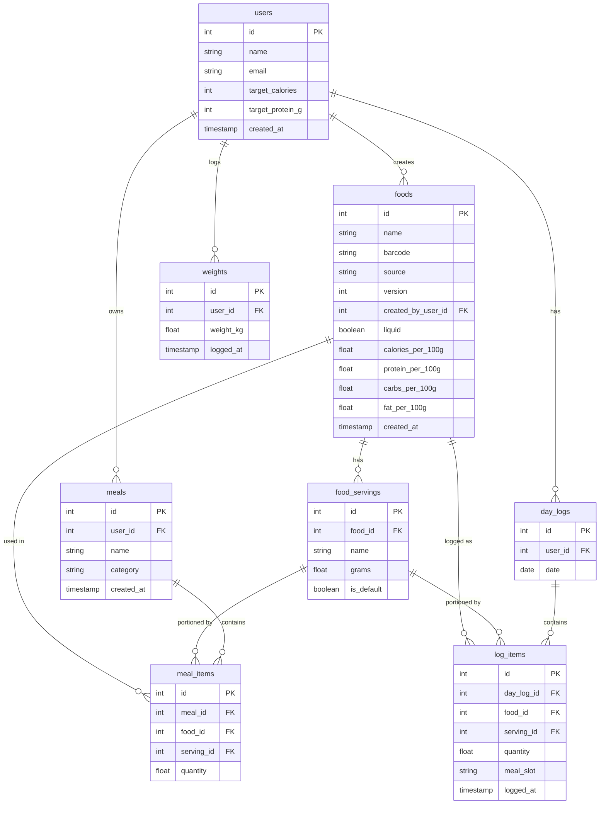

# Database Schema

## ER Diagram

---

## Table Descriptions

### users

The app user. Stores their calorie and protein targets.

| Column             | Type      | Notes                        |
|--------------------|-----------|------------------------------|
| id                 | int       | PK                           |
| name               | text      |                              |
| email              | text      | unique                       |
| target_calories    | int       | daily calorie goal           |
| target_protein_g   | int       | daily protein goal in grams  |
| created_at         | timestamp |                              |

---

### foods

The canonical food item. All nutrition values are stored **per 100g**.

| Column             | Type      | Notes                                                        |
|--------------------|-----------|--------------------------------------------------------------|
| id                 | int       | PK                                                           |
| name               | text      |                                                              |
| barcode            | text      | nullable, unique                                             |
| source             | enum      | `USER`, `VERIFIED`, `OPENFOODFACTS`                          |
| version            | int       | increments when a food is edited (creates new row)           |
| created_by_user_id | int       | FK → users, nullable for system/verified foods               |
| liquid             | boolean   | true for drinks; UI shows "per 100ml" instead of "per 100g"  |
| calories_per_100g  | float     |                                                              |
| protein_per_100g   | float     |                                                              |
| carbs_per_100g     | float     |                                                              |
| fat_per_100g       | float     |                                                              |
| created_at         | timestamp |                                                              |

**Foods are immutable.** Editing a food creates a new row with an incremented version. Old log entries reference their original food row and will never silently change calorie values.

---

### food_servings

Custom serving units for a food (e.g. "1 slice = 30g", "1 egg = 55g").

| Column     | Type    | Notes                              |
|------------|---------|------------------------------------|
| id         | int     | PK                                 |
| food_id    | int     | FK → foods                         |
| name       | text    | e.g. "slice", "piece", "tbsp"      |
| grams      | float   | how many grams this serving equals |
| is_default | boolean | shown first in the portion picker  |

---

### meals

A saved, reusable meal (e.g. "My usual breakfast").

| Column     | Type      | Notes                                         |
|------------|-----------|-----------------------------------------------|
| id         | int       | PK                                            |
| user_id    | int       | FK → users                                    |
| name       | text      |                                               |
| category   | enum      | `BREAKFAST`, `LUNCH`, `DINNER`, `SNACK`       |
| created_at | timestamp |                                               |

---

### meal_items

The foods that make up a saved meal, with their quantities.

| Column     | Type  | Notes                                             |
|------------|-------|---------------------------------------------------|
| id         | int   | PK                                                |
| meal_id    | int   | FK → meals                                        |
| food_id    | int   | FK → foods                                        |
| serving_id | int   | FK → food_servings, nullable (falls back to 100g) |
| quantity   | float | number of servings                                |

**Planned evolution (Phase 5 — Nested Meal Collections):** Add a nullable `sub_meal_id` column (FK → meals) so a meal item can reference either a food or another meal — never both. This enables composable collections like "Usual breakfast" containing a "2 scrambled eggs" sub-meal plus individual items.

Constraints to enforce when implemented:

- Exactly one of `food_id` or `sub_meal_id` must be non-null (check constraint)
- Cycle detection required — a meal cannot reference itself directly or transitively; validate the full ancestor chain on insert
- Macro calculation becomes recursive: sum the resolved macros of all nested items depth-first

---

### day_logs

One row per user per day. The parent record for all log items on that day.

| Column  | Type | Notes          |
|---------|------|----------------|
| id      | int  | PK             |
| user_id | int  | FK → users     |
| date    | date | unique per user |

---

### log_items

A single food entry in a day's log.

| Column      | Type      | Notes                                             |
|-------------|-----------|---------------------------------------------------|
| id          | int       | PK                                                |
| day_log_id  | int       | FK → day_logs                                     |
| food_id     | int       | FK → foods                                        |
| serving_id  | int       | FK → food_servings, nullable (falls back to 100g) |
| quantity    | float     | number of servings                                |
| meal_slot   | enum      | `BREAKFAST`, `LUNCH`, `DINNER`, `SNACK`           |
| logged_at   | timestamp |                                                   |

**Macro calculation:** `(food.calories_per_100g / 100) * serving.grams * quantity`

---

### weights

Body weight log entries.

| Column    | Type      | Notes      |
|-----------|-----------|------------|
| id        | int       | PK         |
| user_id   | int       | FK → users |
| weight_kg | float     |            |
| logged_at | timestamp |            |
